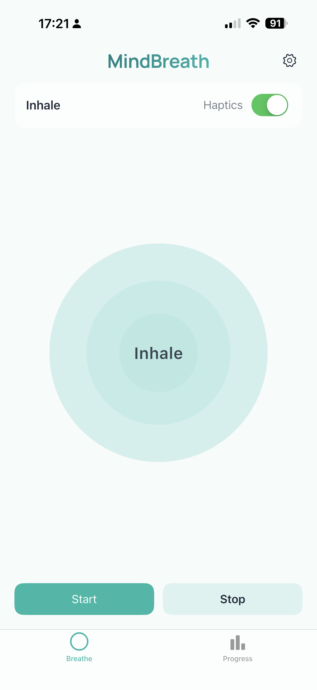
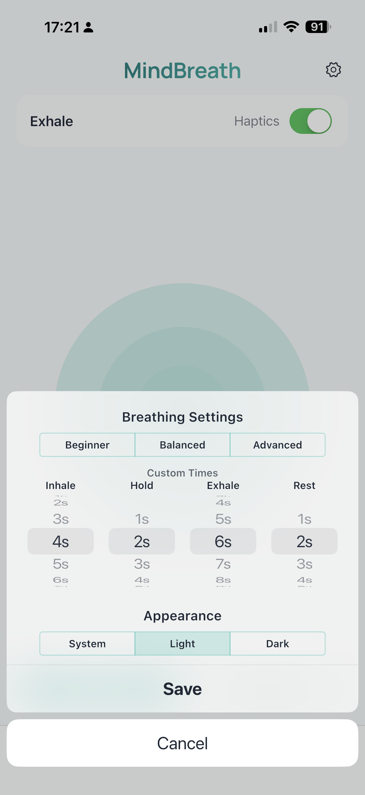
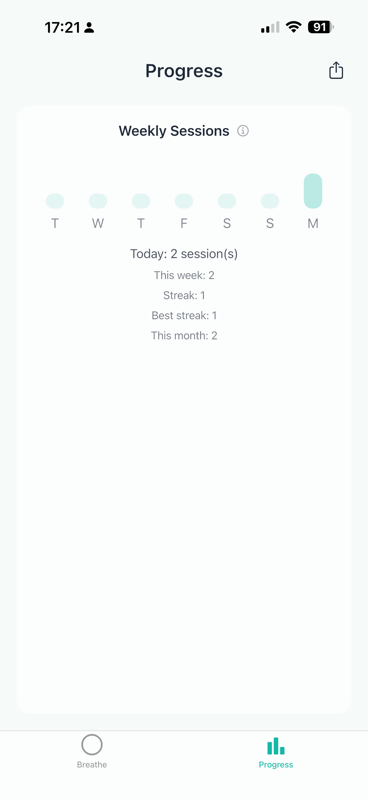

# MindBreath

[Download on the App Store](https://apps.apple.com/gb/app/mindbreath/id6752007065)

MindBreath is a guided breathwork app for iOS and Android designed to help users reduce stress and improve focus through structured breathing cycles.

Developed as an Independent Degree Project, MindBreath combines evidence from mindfulness and slow breathing research with a clean mobile interface, visual breathing guidance, haptic feedback and progress tracking.

---

## Status

- Production mobile application
- Available on App Store
- Android release in progress

---

## Overview

MindBreath guides users through four breathing phases:

- Inhale
- Hold
- Exhale
- Rest

The app was created to provide a lightweight and distraction free digital wellbeing tool that is simple to use and grounded in academic research on paced breathing and mindfulness.

---

## Features

- Guided four phase breathing cycle
- Animated visual breathing globe
- Haptic feedback for phase transitions
- Beginner, Balanced, and Advanced presets
- Fully custom breathing timings
- Light, Dark and System appearance modes
- Progress tracking with streaks and weekly charts
- CSV export for session data

---

## Motivation

This project was developed to explore how research breathing exercises can be translated into a practical and accessible mobile application.

MindBreath began as a degree artefact focused on digital wellbeing, stress management and simple user design. The project also allowed me to strengthen skills in mobile development, interface design and project management.

---

## Academic Context

MindBreath was developed as part of an Independent Degree Project.

The project combines:
- digital wellbeing
- research design
- mobile development
- user evaluation

It demonstrates how scientific findings on breathwork can be translated into a functional mobile application.

---

## Testing and Evaluation

MindBreath was evaluated through:

- timing accuracy testing
- cross platform testing (iOS and Android)
- self testing for functionality
- peer testing with external users

Testing confirmed:
- accurate breathing intervals (±1 second)
- responsive interface across devices
- clear usability and interaction flow

---

## Tech Stack

- **Framework:** Flutter
- **Language:** Dart
- **UI Style:** Cupertino design
- **Local Storage:** SharedPreferences
- **Mobile Features:** Haptic feedback
- **Platforms:** iOS and Android

---

## How It Works

MindBreath uses a timed breathing cycle with four stages:

1. Inhale  
2. Hold  
3. Exhale  
4. Rest  

Users can choose a preset or define their own custom timings.  
The animated rings expand and contract to provide visual guidance, while optional haptic feedback supports smooth phase transitions.

---

## Screenshots

### Home Screen


### Settings


### Progress Tracking


---

## For Developers

### Prerequisites

- Flutter SDK installed
- Dart installed
- Xcode for iOS development
- Android Studio for Android development

### Run the project

```bash
git clone https://github.com/CarlosSemeao/mindbreath.git
cd mindbreath
flutter pub get
flutter run
```
## App Store
MindBreath is available on the App Store
https://apps.apple.com/gb/app/mindbreath/id6752007065

---

## Author

Carlos Semeao  
BSc Computer Science – Solent University  
GitHub: https://github.com/CarlosSemeao

